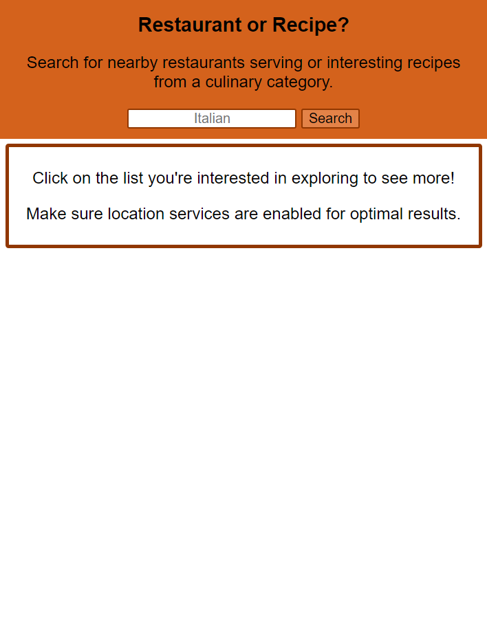
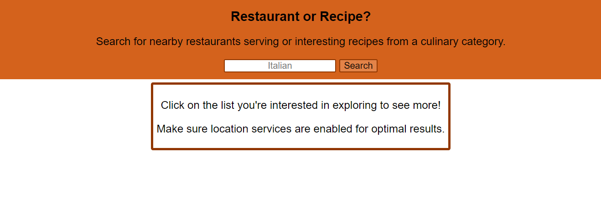
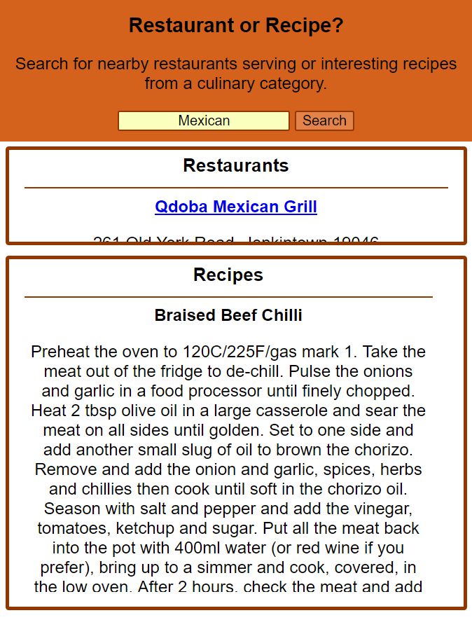

# Restaurant or Recipe

A project to help users satisfy their cravings

Try it out: https://sam-parkinson.github.io/restaurants-recipes/

## Screenshots

Mobile:

Desktop:

Results:

## About

Try searching for a particular cuisine to find interesting recipes and nearby restaurants!

Built using HTML, CSS, JavaScript, and jQuery, featuring restaurant data from Zomato's API and recipe data from TheMealDB's API.
